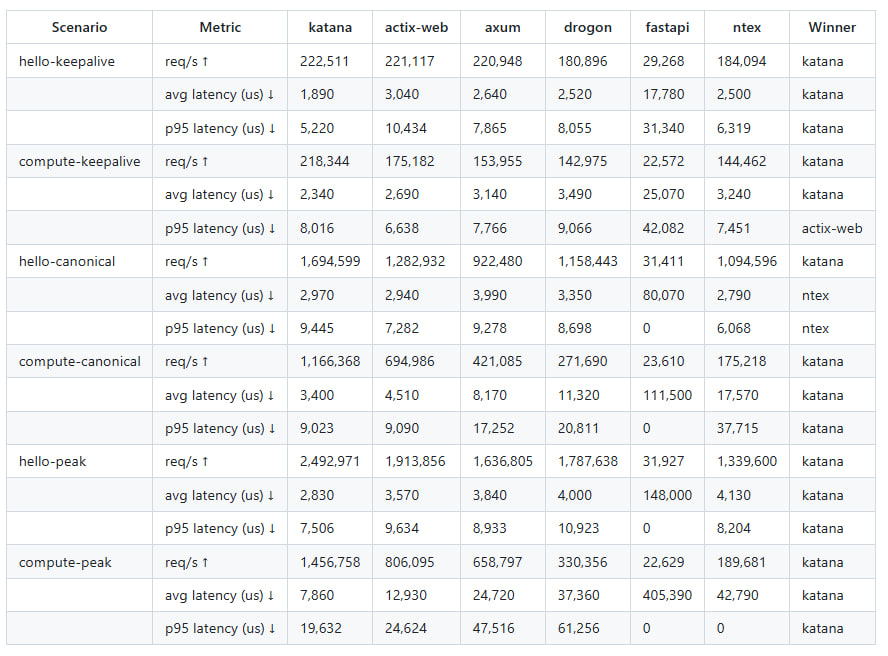

# HTTP Framework Comparison Suite

This directory contains small benchmark targets for the maintained KATANA E2E
scenarios plus a keep-alive control pass:

- `GET /` using `test/load/scripts/hello_pipeline.lua` with depth `1`
- `POST /compute/sum` using `test/load/scripts/compute_sum_pipeline.lua` with depth `1`
- `GET /` using `test/load/scripts/hello_pipeline.lua`
- `POST /compute/sum` using `test/load/scripts/compute_sum_pipeline.lua`

The goal is not feature parity with each framework. The goal is to benchmark the
same hot paths and payloads that KATANA already measures in stages 9-12 while
separating a router-only baseline from KATANA's optimized fast paths.

## What Was Compared

The comparison matrix covers:

- KATANA router-only baseline
- KATANA optimized fast-path
- Rust `actix-web`
- Rust `axum`
- Rust `ntex`
- C++ `Drogon`
- Python `FastAPI`

Every server was benchmarked only on the two maintained HTTP paths:

- `GET /` returning `Hello, World!`
- `POST /compute/sum` returning the sum of a JSON number array

This keeps the comparison focused on the same user-visible scenarios that
KATANA already tracks in its own benchmark stages while separating ordinary
keep-alive traffic from pipelined stress traffic.

## How It Was Compared

The runs were performed with the same benchmark inputs and runner logic used by
KATANA:

- same Lua scripts:
  - `test/load/scripts/hello_pipeline.lua`
  - `test/load/scripts/compute_sum_pipeline.lua`
- two traffic modes:
  - keep-alive control: `KATANA_PIPELINE_DEPTH=1`
  - pipeline stress: `KATANA_PIPELINE_DEPTH=10/20/40`
- same wrk shape:
  - canonical: `t=4`, `c=512`, `10s`
  - peak: `t=4`, `c=512`, `5s`
- same worker count for every server: `4`
- same aggregation policy: `median of 3`
- one unreported warmup run before each measured target/scenario pair
- sequential execution only:
  - only one server was running during a measurement
  - no parallel framework runs
- two KATANA comparison modes:
  - `katana-router-only`: standard router/generated router path
  - `katana-fastpath`: the optimized dispatch path used by the maintained KATANA E2E stages

The runner for this suite is [run_framework_benchmarks.py](C:/Users/Ya/OneDrive/Desktop/KATANA/scripts/run_framework_benchmarks.py),
which reuses the same wrk parsing approach as
[run_benchmarks.py](C:/Users/Ya/OneDrive/Desktop/KATANA/scripts/run_benchmarks.py).

Interpretation matters:

- keep-alive depth `1` is the closest thing here to a normal HTTP/1.1 API pass
- depth `>1` is an HTTP/1.1 pipelining stress test
- large framework deltas under pipelining do not automatically transfer to
  ordinary production traffic
- for the fairest framework-to-framework comparison, use `katana-router-only`
- use `katana-fastpath` as a second view that shows what KATANA's optimized path can do

## Where It Was Compared

The comparison environment used for the recorded runs was:

- Ubuntu 24.04 VM
- framework servers running inside the VM
- `wrk` also running inside the same VM

That means the benchmark is fair at the HTTP scenario level, but it is still a
same-host measurement, not a full cross-machine network-stack benchmark. For
final latency claims, rerun from a separate load-generator machine against the
VM IP.

## Latest Snapshot

The current full report (8 scenarios including DB SELECT/INSERT, pipelining,
local pinned + remote WAN runs, charts and raw data) is
[RESULTS_2026-07-16.md](RESULTS_2026-07-16.md).

The previous snapshot is shown below.



## Layout

- `actix_web/` - Rust `actix-web` server
- `axum/` - Rust `axum` server
- `ntex/` - Rust `ntex` server
- `drogon/` - C++ Drogon server
- `fastapi/` - Python FastAPI server
- `targets.example.json` - ready-to-edit benchmark target matrix

Each server implements the same endpoint set with identical validation:

- `GET /` -> `Hello, World!` (plain text)
- `GET /json` -> `{"message":"Hello, World!"}` (minimal JSON serialization)
- `POST /compute/sum` -> JSON number equal to the sum of the input array
- `POST /compute/stats` -> `{min,max,mean,sum,count[,median]}` for
  `{"values":[...], "include_median":bool}` (1..=10000 numbers)
- `POST /echo` -> `{"message":<transformed>,"length":N}` for
  `{"message":str<=4096, "repeat":1..=100, "uppercase":bool}`
- `GET /health` -> `{"status":"ok","uptime_ms":N}`
- PostgreSQL-backed `/items` CRUD (same schema, same SQL, same seed):
  - `GET /items?limit=&offset=&category=` — paginated SELECT + JSON array
  - `GET /items/{id}` — single-row SELECT + JSON (db-point-select scenario)
  - `POST /items` — INSERT ... RETURNING + JSON of the created row
    (db-insert-returning scenario, requires `X-Request-Id` UUID header)
  - `PUT /items/{id}`, `DELETE /items/{id}`

For `/compute/sum`, every implementation enforces the same request shape that
the KATANA OpenAPI example uses:

- JSON array of numbers
- minimum 1 item
- maximum 1024 items

On the KATANA side, `/json`, `/echo`, `/compute/stats` and the `/items` CRUD
are served by the `benchmark_api` codegen example (generated from
`examples/codegen/benchmark_api/api.yaml`), which is where those endpoint
contracts come from.

## Why a Separate Folder

The comparison servers are isolated on purpose:

- no changes to KATANA runtime or main CMake graph
- no foreign framework dependencies added to the main build
- easy to copy or deploy only the comparison suite onto a Linux host

## Recommended Methodology

If you want real network-stack numbers, do not run wrk on the same machine as
the server. Run the framework servers on the Linux VM and run
`scripts/run_framework_benchmarks.py` from another machine against the VM IP.

That preserves the existing wrk scenarios while adding a real TCP path between
client and server.

## Prerequisites on the Linux Server

Use a machine with enough free disk for multiple toolchains. In practice, plan
for at least:

- 2 GB free disk
- Rust toolchain for `actix-web`, `axum`, and `ntex`
- Python 3 + venv/pip for FastAPI
- Drogon installed and discoverable by CMake for the C++ target
- `wrk` on the machine that generates load

## Example Build and Run Commands

### KATANA router-only baseline

```bash
cmake --preset examples
cmake --build build/examples --target hello_world_router_server compute_api_router_only -j
HELLO_PORT=18080 KATANA_WORKERS=4 ./build/examples/hello_world_router_server
COMPUTE_PORT=18081 KATANA_WORKERS=4 ./build/examples/examples/codegen/compute_api/compute_api_router_only
```

### KATANA optimized fast-path

```bash
cmake --preset examples
cmake --build build/examples --target hello_world_server compute_api -j
HELLO_PORT=18180 KATANA_WORKERS=4 ./build/examples/hello_world_server
COMPUTE_PORT=18181 KATANA_WORKERS=4 ./build/examples/examples/codegen/compute_api/compute_api
```

### actix-web

```bash
cd comparisons/http_frameworks/actix_web
cargo build --release
PORT=19080 BENCH_WORKERS=4 ./target/release/katana_comparison_actix
```

### axum

```bash
cd comparisons/http_frameworks/axum
cargo build --release
PORT=19081 BENCH_WORKERS=4 ./target/release/katana_comparison_axum
```

### Drogon

```bash
cd comparisons/http_frameworks/drogon
cmake -S . -B build -DCMAKE_BUILD_TYPE=Release
cmake --build build -j
PORT=19082 BENCH_WORKERS=4 ./build/katana_comparison_drogon
```

### ntex

```bash
cd comparisons/http_frameworks/ntex
cargo build --release
PORT=19084 BENCH_WORKERS=4 ./target/release/katana_comparison_ntex
```

### FastAPI

```bash
cd comparisons/http_frameworks/fastapi
python3 -m venv .venv
. .venv/bin/activate
pip install -r requirements.txt
PORT=19083 BENCH_WORKERS=4 python3 app.py
```

## Running the Shared Benchmarks

Use the example target file as a starting point:

```bash
python3 scripts/run_framework_benchmarks.py \
  --targets-file comparisons/http_frameworks/targets.example.json \
  --repeats 5 \
  --aggregation median \
  --warmup-runs 1 \
  --output benchmark_results/framework_comparison
```

The runner reuses the same wrk Lua scripts and the same wrk-output parsing logic
as `scripts/run_benchmarks.py`.

For the fairest framework comparison, use `katana-router-only` as the KATANA
baseline and review keep-alive first. For a 1:1 comparison with the existing
KATANA stages 9-12, add `katana-fastpath` and then inspect the pipeline
scenarios separately.

## Notes About KATANA in the Same Matrix

KATANA currently exposes the maintained optimized benchmark endpoints via two
binaries:

- `hello_world_server`
- `compute_api`

For fairness, this suite also includes router-only KATANA variants:

- `hello_world_router_server`
- `compute_api_router_only`

The example target file uses `scenario_urls` for both KATANA variants and a
single `base_url` for the comparison servers.
